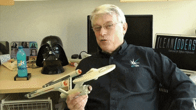
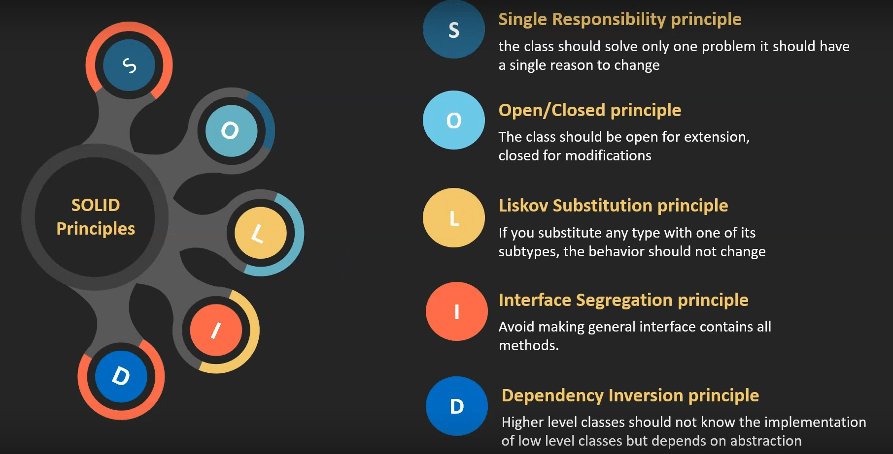

# POO-SOLID-php

 
  

  

  

 
# SRP (Single Responsability Principle) 
## Une classe, une responsabilité, un rôle. 
### 1- Organistaion 
### 2- Testabilité (test unitaires) 
### 3- Flexibilité 
### 4- Evolutivité.      
  
# OCP (Open Closed Principle) 
## Ouverte à l'extension, fermée à la modification. 
### Principes et définition de [Bertrand Meyer(1988)](https://fr.wikipedia.org/wiki/Bertrand_Meyer)  et [Rober C. Martin (oncle Bob)](https://fr.wikipedia.org/wiki/Robert_C._Martin).   
 
 # LSP (Liskov Substitution Principle) 
 ## Les enfants font comme les parents. 
 ### Lorsqu'une classe A utilise une classe B, il faut qu'elle puisse utilisée n'importe quel enfant de la classe B sans que ça pose de problème.(signature des mèthodes). 
  ### Principe de substitution de [Barbara Liskov](https://fr.wikipedia.org/wiki/Barbara_Liskov) , [Jeannette Wing](https://fr.wikipedia.org/wiki/Jeannette_Wing).   
  
# ISP (Interface Segregation Principle) 
## Le SRP des interfaces. 
### La notion d'interface permet de définir des contrats en ce qui concerne les méthodes que devront avoir les classes qui signent ce contrat, et qui donc implémentent cette interface. 

#### Aucun client (classes qui se servent de l'interface) ne devrait dépendre des méthodes qu'il n'utilise pas. 

-- <cite>Robert C. Martin</cite> 

Le i de SOLID discute avec le S de SOLID.   

  
# DIP (Dependency Inversion Principle) 
## On dépend d'abstraction, pas d'implémentations.  
:red_circle::exclamation:Ne pas confondre avec le principe d'injection des dépendances qui est une pratique et non pas un principe SOLID.
### Un module de haut niveau ne devrait pas dépendre de modules de bas niveaux. Les deux devraient dépendre d'une abstraction.
-- <cite>Robert C.Martin</cite>  

 
## L'avantage du principe SOLID c'est qu'il fait de votre projet quelquechose de plus intelligent, de plus flexible et de plus évolutif. 
### 1. Avec des classe plus petites (SRP); qui ont des responsabilité bien définie . où les fichiers sont correctement organisés, et où on va pouvoir retrouver facilement où se trouve quel code et qui fait quoi!. 
### 2. Des classes plus évolutives (OCP) ; On va pouvoir avoir des classes qui vont être enrichies ( comportement plus puissant) mais sans y toucher (fermées aux modifications mais ouvertes à l'extension). 
### Merci Uncle Bob! 
 

### 3. Quand une classe A utilise les méthodes de la classe B, elle doit pouvoir utiliser n'importe quelle autre classe enfant de B sans que cela change radicalement son comportement (LSP).  

### 4. (ISP) Si une interface posséde trop de méthodes, les classes qui vont implémenter cette interface auront trop de méthodes, trop de code et potentielement ne respecterons pas le SRP et surtout on pourrait se retrouver avec des classes qui implémentent une interface mais qui n'aurait pas besoin de toutes ses fonctions. D'où des interfaces le plus limitées possibles avec un scope bien précis. Mieux vaut implémenter une classe avec plusieurs interfaces. 

### 5. Mieux vaut dépendre d'une abstraction que d'implémentations concrètes. Le fait de dépendre d'une abstraction permet d'envoyer n'importe quelle classe qui implémente cette abstraction. Cela permet d'avoir des classes très évolutives.  

## En bref,  un projet mieux organisé, plus joli, plus lisible, beaucoup plus évolutif et maintenable dans le temps.  

  

enjoy!!!!

